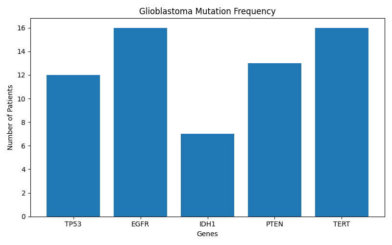
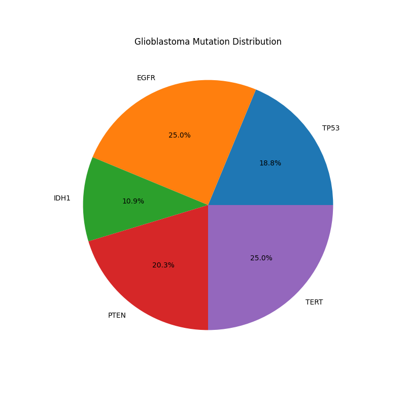
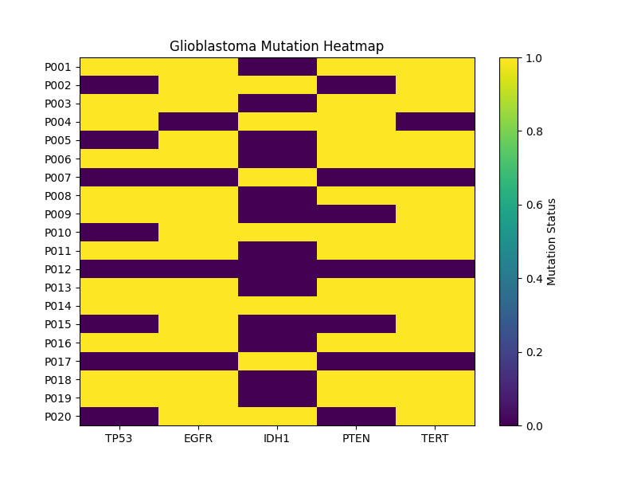

# Glioblastoma Mutation Analysis

## Overview

This project analyzes common genetic mutations found in Glioblastoma (GBM), one of the most aggressive primary brain tumors.

The analysis focuses on five important genes:

* TP53
* EGFR
* IDH1
* PTEN
* TERT

---

## Objectives

* Explore mutation patterns in Glioblastoma patients.
* Perform basic mutation frequency analysis.
* Visualize mutation distribution using charts.
* Create a simple bioinformatics portfolio project.

---

## Dataset

The dataset contains mutation information for 20 simulated Glioblastoma patients.

Genes analyzed:

| Gene | Full Name                        |
| ---- | -------------------------------- |
| TP53 | Tumor Protein p53                |
| EGFR | Epidermal Growth Factor Receptor |
| IDH1 | Isocitrate Dehydrogenase 1       |
| PTEN | Phosphatase and Tensin Homolog   |
| TERT | Telomerase Reverse Transcriptase |

---

## Technologies Used

* Python
* Pandas
* Matplotlib

---

## Analysis Performed

### 1. Mutation Frequency Analysis

Calculated mutation frequencies for all genes.

### 2. Bar Chart Visualization

Visualized mutation counts across genes.

### 3. Pie Chart Visualization

Displayed mutation distribution percentages.

### 4. Heatmap

Generated a mutation heatmap showing mutation patterns across patients.

### 5. Statistical Summary

Calculated mutation percentages for each gene.

---

## Results

The analysis showed:

* EGFR mutations were among the most frequent.
* TERT promoter mutations were highly prevalent.
* IDH1 mutations were less common.
* TP53 and PTEN alterations were observed in many patients.

---

## Author

Dr. Abdulrahman Saleh

Bioinformatics Portfolio Project
## Results

### Mutation Bar Chart

### Mutation Distribution Pie Chart

### Mutation Heatmap

